##系统先生」业务架构设计
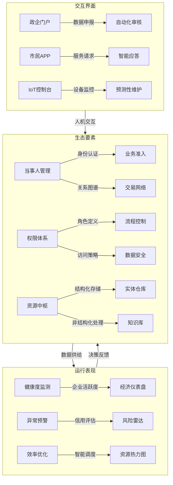

##1. 当事人管理体系  
##2. 权限治理体系
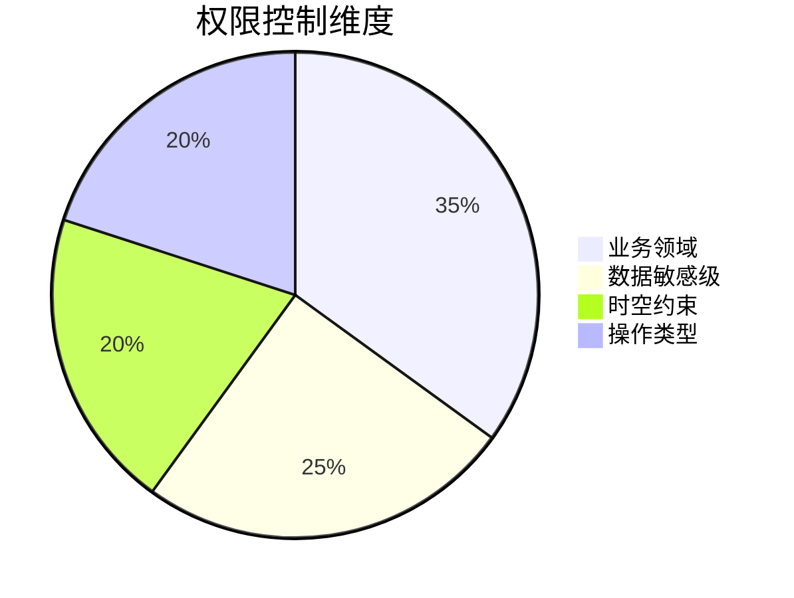

##🌐 统一业务架构图（Unified Business Architecture）
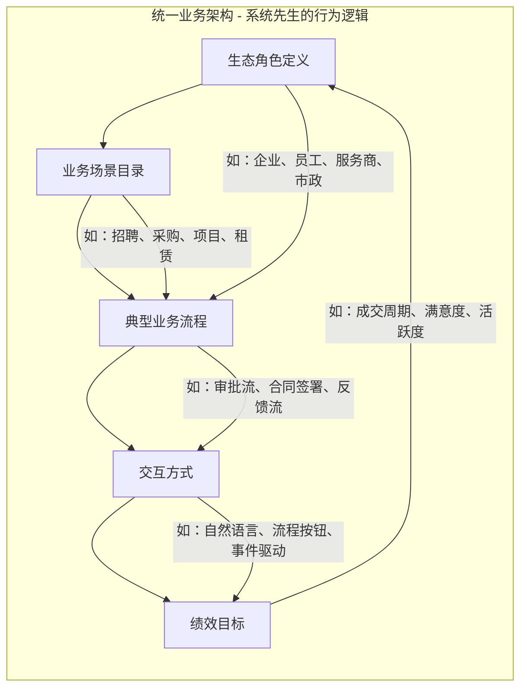
##3. 资源中枢架构  
混合存储策略：

| 数据类型         | 存储方案                   | 检索方式           |
|------------------|---------------------------|--------------------|
| 企业注册信息     | PostgreSQL（结构化）       | SQL查询            |
| 合同文档         | MinIO + ChromaDB          | 语义检索           |
| 传感器时序数据   | TimescaleDB               | 时间序列分析       |
| 市民反馈         | Elasticsearch             | 全文检索           |


##1. 企业健康诊断
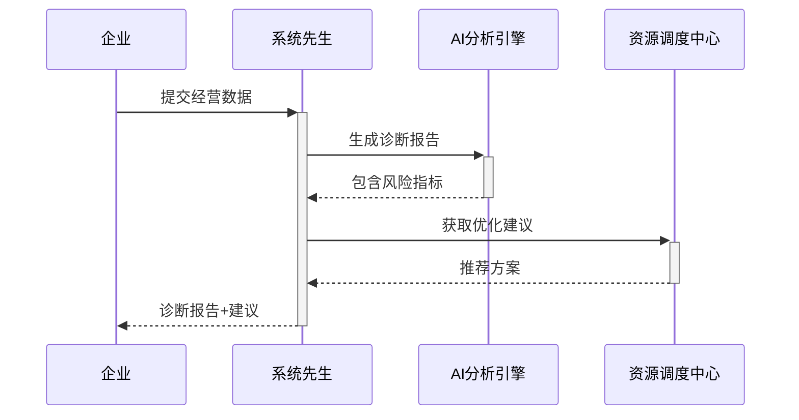
##演进路线建议
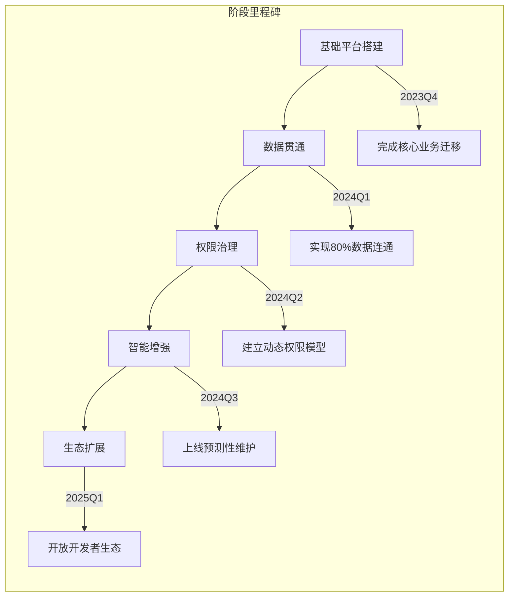

##数字孪生可视化
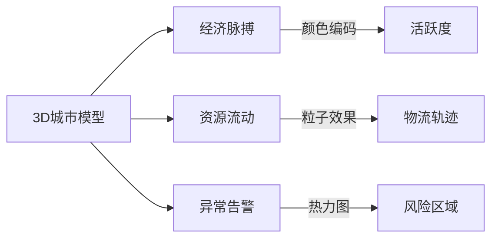

##🧠 系统治理与健康监控架构（Governance & Observation）
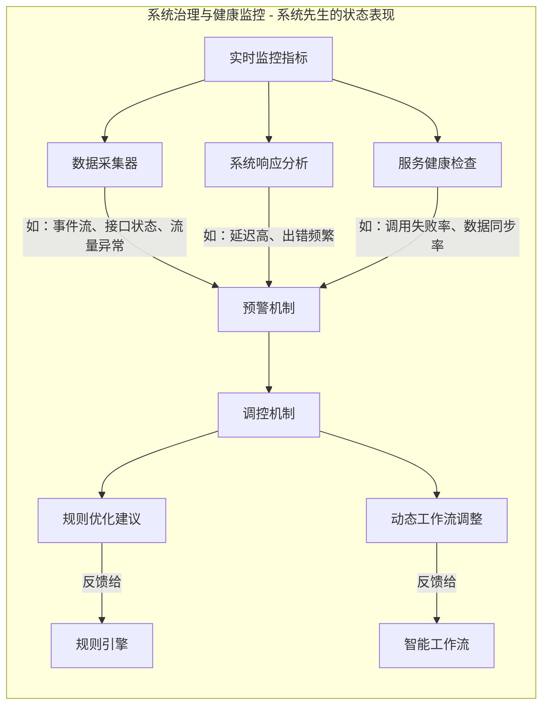

##🧩 全景架构整合图（系统先生完整图）
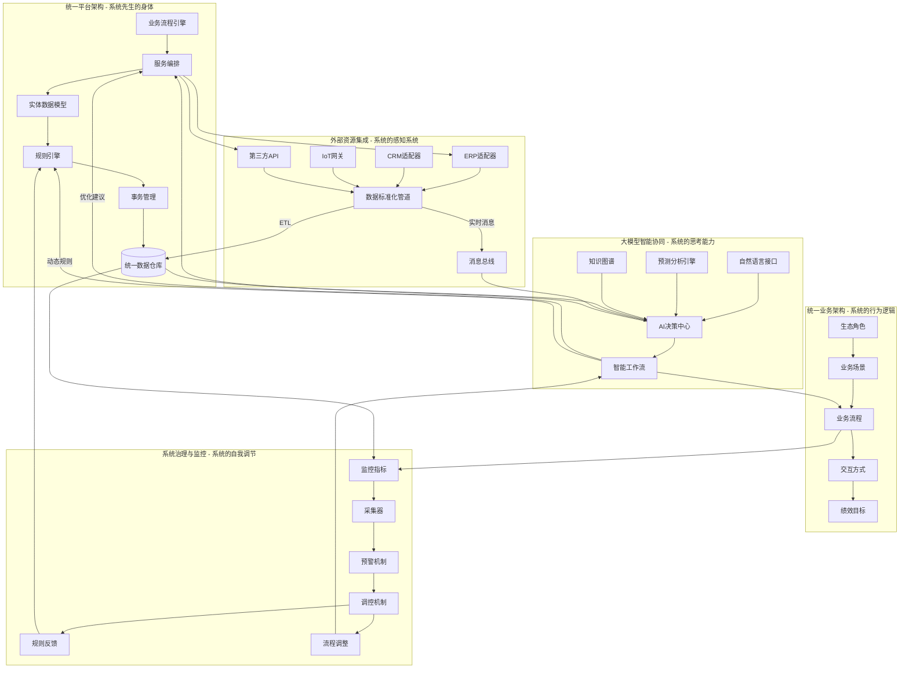

##统一平台架构设计
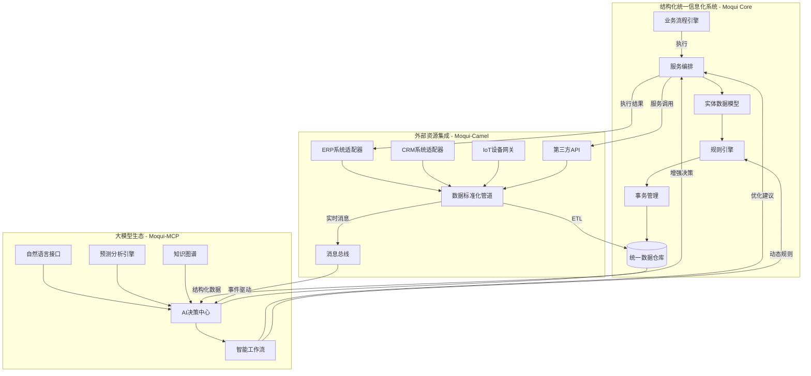

## MCP核心功能
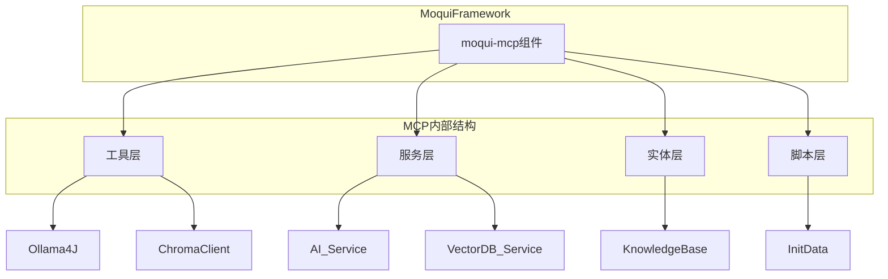
### 消息处理流程
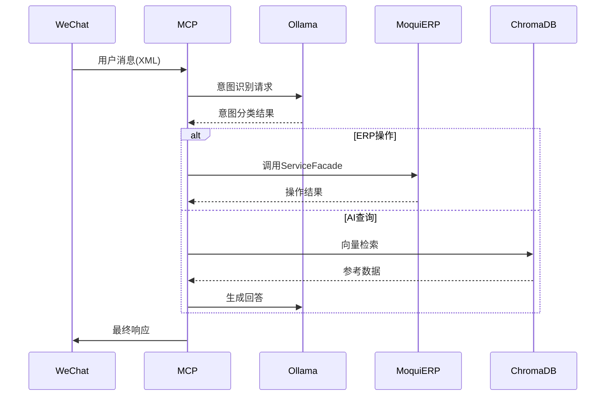
## A moqui-wechat component

To install run (with moqui-framework):

    $ ./gradlew getComponent -Pcomponent=moqui-wechat

To test run(use --tests ""*WechatServices" match the case)：

    $ ./gradlew :runtime:component:moqui-wechat:test --tests "*WechatServices"


To build the `moqui-wechat` component and integrate a suitable AI tool, here are the steps and AI options you should consider:

To integrate **Ollama with Llama 3.1** into your **moqui-wechat** component using the **ollama4j plugin**, here is a refined and clear description of the process:


This approach enables a private, secure, and scalable AI-powered WeChat interaction system within the Moqui ERP environment using **Ollama with Llama 3.1** and the **ollama4j plugin**.

### WeChat public account AI integration
pay attention to the model llama version's params difference. llama3.1 / llama3.2
need update the ollama jar for the new version of the model.

- [x] call local ollama server with model llama3.2
  ```
curl -X POST http://localhost:11434/api/generate \
-H "Content-Type: application/json" \
-d '{
"model": "llama3.2",
"prompt": "Hello, how are you?",
"temperature": 0.7,
"max_tokens": 100
}'
  ```
- [x] call the remote ollama server with model llama3.1
  ```
curl http://localhost:11434/api/generate -d '{
"model": "llama3.1",
"prompt": "Why is the sky blue?"
}' -H "Content-Type: application/json"
  ```
- [x] call remote ollama server from local
  ```
ssh -L 11434:localhost:11434 root@192.168.0.141   
curl http://localhost:11434/api/generate -d '{
"model": "llama3.1",
"prompt": "Why is the sky blue?"
}' -H "Content-Type: application/json"
  ```
- [x] moqui-wechat call ollama by moqui-wechat
  ```
./gradlew :runtime:component:moqui-wechat:test --info
  ```

### Use RAG Flow to make my private domain data have the AI ability

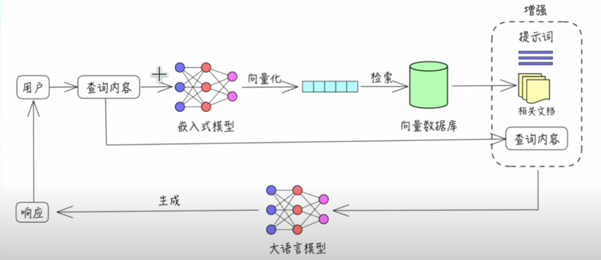

#### Step1:setup python env , chromadb and run as server mode
- require python3+ env: current use python 3.12.3
- python -m venv myenv
- active the env: source ~/myenv/bin/activate\n
- install the chromadb: pip install chromadb
- run chromadb as server mode: chroma run --path /db_path
  ```
//测试时允许重置数据库
ALLOW_RESET=TRUE chroma run --path /Users/demo/chromadb
  ```

#### Step2: run ollama and use EmbeddingFunction
```
// 配置 Ollama Embedding Function
System.setProperty("OLLAMA_URL", "http://localhost:11434/api/embed");
EmbeddingFunction ef = new OllamaEmbeddingFunction(WithParam.baseAPI(System.getProperty("OLLAMA_URL")));

// 创建 HR 数据知识库 Collection
Collection collection = client.createCollection("hr-knowledge", null, true, ef);
```
#### Step2: load the test data and run the gradle script
- Use HrDataIndexer to import test data into chromadb
- add dependence of the chromadb:chromadb-java-client.jar 
- use some test data
```
城市	姓名	手机号
上海	闵大	13661410000
上海	李二	15601720001
上海	戚三	15290860002
上海	李四	17721390003
```
### Step3: run the query script
- more info will get more correct
```
// 查询城市和姓名相关信息（例如：查询上海的李蜜的手机号）
String query = "查询东莞常平镇的刘文博手机号";
Collection.QueryResponse qr = collection.query(Arrays.asList(query), 5, null, null, null);
```
